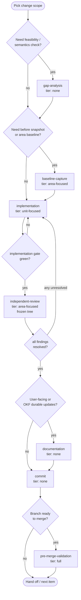
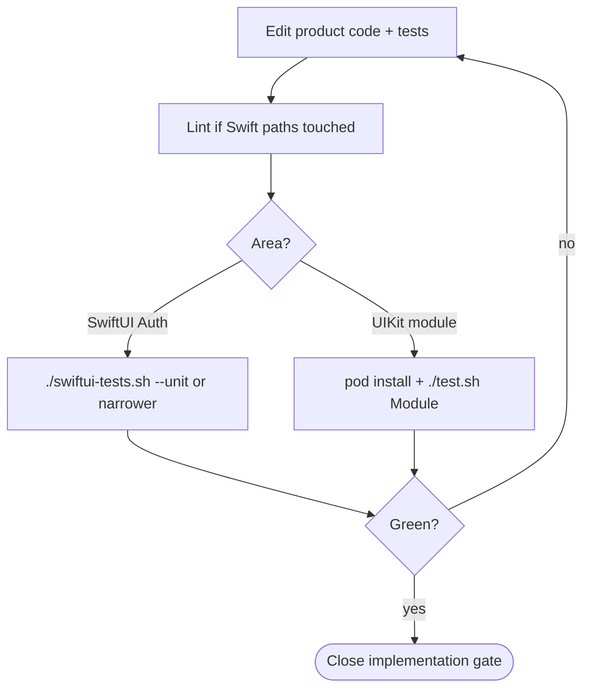

# Change authoring workflow

Single source for **how to author and verify a product change** in FirebaseUI-iOS (bug fix, feature, parity, coverage). Module docs add artifacts; work queues add ephemeral gate state — neither restates this loop.

**Policy:** [OKF documentation and commit policy](../documentation-policy.md). **Terms:** [iteration vocabulary](iteration-vocabulary.md).

## Primary loop



## Work types

| Work type | When | Validation tier | Product edits | Commit |
|-----------|------|-----------------|---------------|--------|
| `gap-analysis` | Unclear feasibility, API shape, provider support | none | read-only | no |
| `baseline-capture` | Need before metrics or area suite baseline | `area-focused` | local narrowing OK | no |
| `implementation` | Author fix/feature + tests | `unit-focused` | yes | no |
| `independent-review` | Verify frozen diff | `area-focused` | no — [frozen tree](#frozen-tree) | no |
| `documentation` | User docs + durable OKF updates | none | docs only | no |
| `commit` | Gates closed for the item | none | staging only | yes |
| `pre-merge-validation` | Branch merge gate | `full` | revert narrowing first | no |

**Commands per work type:** [validation checklist](validation-checklist.md) — link only; do not duplicate here.

## Validation tiers

Tier id strings: [iteration vocabulary § validation tier identifiers](iteration-vocabulary.md#validation-tier-identifiers).

| Tier | Intent | Typical commands |
|------|--------|------------------|
| `unit-focused` | Fast loop while editing | Touched-area only: e.g. `./swiftui-tests.sh --unit` or `./test.sh FirebaseDatabaseUI`; `./lint-swift.sh` when Swift touched |
| `area-focused` | Full suite for the change area | SwiftUI Auth: `./swiftui-tests.sh --lint --all`. UIKit module: `./test.sh <Module>` + SPM scheme build for that product when sources shared with `Package.swift` |
| `full` | Pre-merge / CI-equivalent | All suites affected by the branch + sample builds when samples/`Package.swift`/podspecs touched — [validation checklist](validation-checklist.md) |

**Command rule:** Agents run **only** [agent command policy](agent-command-policy.md) allowlisted commands — no improvised `xcodebuild` / `pod` / `swift test` probes.

## Gates

| Gate | Closes when |
|------|-------------|
| `implementation` | `implementation` work type complete — code plus **unit-focused** checks green for every required path ([distribution path gate](running-tests.md#distribution-path-gate-blocking)); lint green on the diff when applicable |
| `review` | `independent-review` complete — **area-focused** checks green on frozen tree; applicable [validation checklist](validation-checklist.md) rows green; **every review finding resolved** ([§ quality standards](#quality-standards)) |
| `commit` | Durable commit exists for the item **after** prior gates closed with [recorded evidence](#validation-evidence-blocking) |

**Trust rule:** Code on disk or in git with `review` still **open** is unverified until `independent-review` closes the gate.

Any unresolved review finding returns the item to **`implementation`** (`unit-focused`), then repeats **`independent-review`** (`area-focused`).

<a id="validation-evidence-blocking"></a>

### Validation evidence (blocking)

Gates close **only** when **recorded evidence** shows the required validation tier ran and passed. Assumed green, implementer summaries without exit codes, or "tests passed earlier" without a log path **do not** close a gate.

| Gate | Minimum evidence (record in work-queue notes or review handoff) |
|------|------------------------------------------------------------------|
| **`implementation`** | Canonical command(s) + **exit codes**; log path when using `swiftui-tests.sh` / `xcodebuild` tees; **`./lint-swift.sh` exit 0** when Swift under its paths changed |
| **`review`** | Frozen-tree re-run of area-focused checklist; coverage notes when enabled ([coverage design](coverage-design.md)); sample/`pod lib lint` rows when those surfaces changed |
| **`commit`** | Prior gates closed **with evidence**; no temporary `#if DEBUG` test skips or focused-only hacks staged |
| **Publication** (`git push`, PR refresh) | **`review` gate closed on the exact commits being published**; evidence still valid (no product edits since last area-focused run) |

<a id="forbidden-shortcuts"></a>

### Forbidden shortcuts

- **`git commit`** while the current work type's validation tier is incomplete or evidence is missing.
- **`git push` / PR update** claiming remediation or review-green **without** fresh area-focused evidence after the last product edit on the published commits.
- **History rewrite** (rebase, amend stack) **without** re-running validation for the rewritten scope — prior green results are **invalid**.
- **Self-accepted** parity or coverage gaps — only [acceptable exceptions](#acceptable-exceptions) with user confirmation or intractability evidence in durable OKF.

## Quality standards

<a id="acceptable-exceptions-intractable-limitation-bar"></a>

### Acceptable exceptions

Only two things may be documented and tracked instead of fixed. **Both require the user's explicit acceptance and confirmation plus a recorded rationale** — an agent or reviewer may not grant either on its own.

1. **Intractable-limitation bar.** Gap caused by an intractable technical limitation of the language, platform SDK, compiler, or toolchain, shown with evidence (cited by version).
2. **User-accepted deferral.** Gap is addressable, but the user explicitly defers it with a documented rationale.

Anything else is drift or a defect:

- **If code can be authored, a test that exercises it can be authored** — otherwise it is dead code; delete it, do not document it.
- Convenience, time pressure, or "low risk" carry weight **only** through an explicit user-accepted deferral.

<a id="review-findings--resolve-do-not-defer"></a>

### Review findings — resolve, do not defer

`independent-review` classifies findings **critical / serious / minor / nit**. The **`review` gate closes only when every finding — including minor and nit — is resolved by a fix**, unless covered by an [acceptable exception](#acceptable-exceptions). "Green with minors" is not green.

## Frozen tree

Required for **`independent-review`** and for any suite run that closes the **`review`** gate:

- No edits to product sources (`FirebaseSwiftUI/**`, `Firebase*UI/**`, `Package.swift`, podspecs, e2e/sample sources under test) during the run.
- Wait for or cancel in-flight runs before editing again.

Keep **`implementation`** and **`independent-review`** in separate passes.

## Host rule

On a shared dev host during change authoring:

- One heavyweight simulator suite at a time (do not overlap `./swiftui-tests.sh` integration/UI with `./test.sh` on the same simulator if contention appears).
- Auth emulator: one listener on `:9099` — prefer letting `./swiftui-tests.sh` manage lifecycle.
- Use only [canonical test commands](running-tests.md).

## `implementation` inner loop



## `independent-review`

On a **frozen tree**:

1. Revert any temporary test focusing / skips.
2. Run **area-focused** suite for the change area ([running tests](running-tests.md)).
3. Run applicable [validation checklist](validation-checklist.md) rows (lint, SPM path, samples, pod lint as needed).
4. Outcome closes **review gate** or returns to **`implementation`**.

## `commit`

- One focused commit per item when gates close.
- **Evidence required:** [§ validation evidence](#validation-evidence-blocking).
- **Work queue:** before `git commit`, set the row's `commit_subject` to the commit's subject line, close `commit_gate`, and stage the queue doc **in the same commit** as the product change ([documentation policy § work queues](../documentation-policy.md#work-queue-documents)). Do not record SHAs in queue docs.

```bash
git status
git diff --stat
```

## Feature parity

User-facing Auth/UI features should stay coordinated with [FirebaseUI-Android](https://github.com/firebase/FirebaseUI-Android) where parity applies ([`CONTRIBUTING.md`](../../CONTRIBUTING.md)). Record parity gaps as durable module notes or accepted exceptions — do not silently ship one-platform-only behavior for shared product surface.

## Related docs

| Topic | Document |
|-------|----------|
| Term ids and queue field schema | [iteration-vocabulary.md](iteration-vocabulary.md) |
| Test commands | [running-tests.md](running-tests.md) |
| Validation commands | [validation-checklist.md](validation-checklist.md) |
| Coverage policy | [coverage-design.md](coverage-design.md) |
| Distribution | [spm-and-cocoapods-workflow.md](../packaging/spm-and-cocoapods-workflow.md) |
| Auth emulator project | [firebase-testing-project.md](firebase-testing-project.md) |
